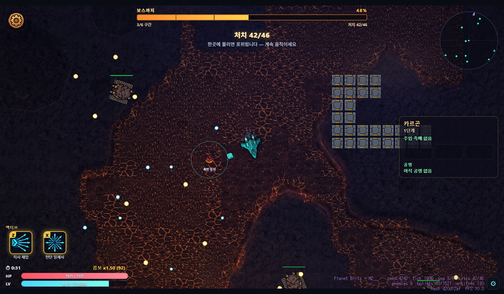
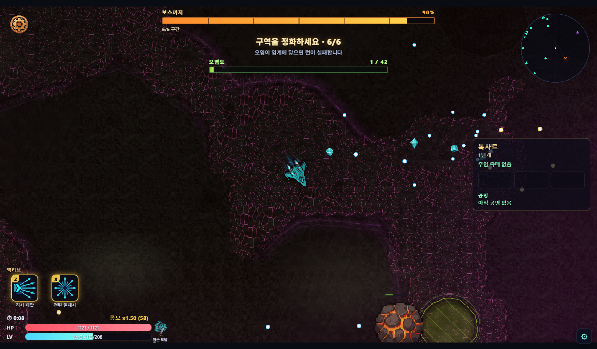
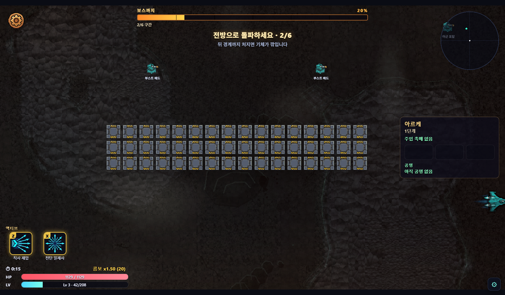
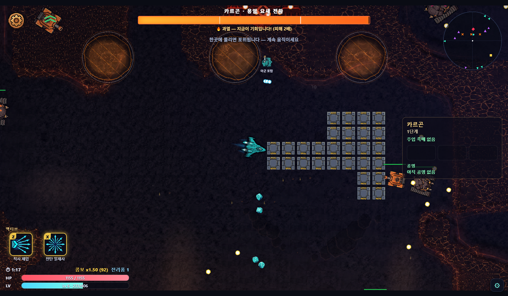
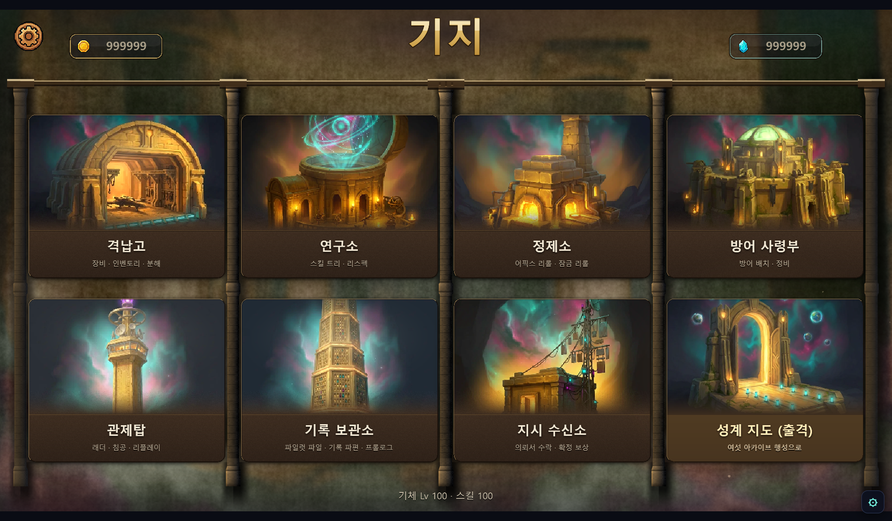
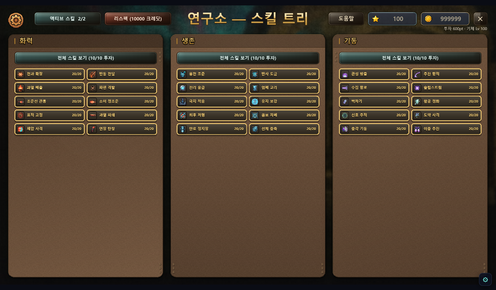

# Planet Blitz — 게임 소개 및 설명서

**NAN 2026 Game×AI 해커톤 사전 과제 · 개인 참가 김민석 · 2026-08-10**

## 1. 게임 제목 및 한 줄 소개

**Planet Blitz (플래닛 블리츠)**

> **"행성을 침략해 장비를 파밍하고, 그 힘으로 상위 랭커의 기지를 뚫어 자리를 빼앗는 탄막 슈팅."**

탑다운 탄막 슈팅 × 디아블로식 장비 파밍 × 비동기 PvP 래더가 한 루프로 맞물린 웹 게임입니다.
공격은 자동, 플레이어의 몫은 **회피와 포지셔닝** — 손은 쉽고 빌드는 깊습니다.

> **1인 · 26일 · 사람이 타이핑한 게임 코드 0줄.** 1,392 커밋 · 498 PR · 자동 테스트
> 8,676건 전량 통과 — 지금 브라우저에서 바로 플레이되는 **실서비스 중인 온라인 게임**입니다.
> AI를 어떻게 지휘해 여기까지 왔는지는 「AI 활용 기술 문서」가 증명합니다.

## 2. 플레이 링크

| 항목 | 링크 |
|---|---|
| **플레이 · 심사용 데모 (로그인 불필요)** | *(데모 빌드 링크 — 배포 후 기재)* |
| **플레이 · 정식 (계정 연동)** | https://v0o0v.github.io/planet-blitz/ |
| **플레이 영상 (YouTube, 30~60초)** | *(영상 링크 — 업로드 후 기재)* |
| 소스 코드 (public) | https://github.com/v0o0v/planet-blitz |

정식 빌드에 구글 로그인을 필수화한 것은 **래더 자리를 빼앗는 비동기 PvP가 계정 없이는
성립하지 않기 때문**입니다. 심사 편의를 위해 같은 소스에서 서버 설정만 뺀 **무로그인 데모
빌드**를 함께 제공합니다 — 네트워크 계층이 설정 부재 시 자동으로 no-op이 되도록 처음부터
설계돼 있어, 코드 분기 없이 같은 소스에서 두 빌드가 나옵니다.

### 3분 심사 경로 (권장)

1. 데모 링크 접속 — 데스크톱 Chrome/Edge, 설치 없음, 로딩 수 초
2. 튜토리얼 런 1회 (약 2분) — `WASD` 이동, `Space` 대시만 기억하면 됩니다
3. 기지 맵에서 **격납고** 클릭 → 방금 주운 장비 장착 → **출격**으로 재출격
4. 더 보시려면: 행성 선택에서 다른 행성을 고르면 **게임플레이 모드 자체가 바뀝니다** (§3)

### 화면 한눈에

| | |
|---|---|
|  |  |
| 카르곤 · 아레나 전투 (처치 할당 HUD) | 톡사르 · 오염 확산 모드 (구역 정화 목표) |
|  |  |
| 아르케 · 강제 스크롤 레이싱 (부스트 패드) | 카르곤 보스전 · 과열 창 (피해 2배 기회) |
|  |  |
| 기지 맵 — 건물 8종 허브 | 연구소 — 3계열 스킬 트리 (기체당 30종) |

## 3. 게임 방법

### 목표

1. **행성을 침략**(PvE 런)해 장비·재화를 파밍한다.
2. 기지에서 **영구 성장**(장비 장착 · 스킬 투자)한다.
3. 더 높은 **침략 단계**를 뚫으며 강해진다.
4. 최종 목표 — **나보다 순위가 높은 플레이어의 기지를 침공(PvP)해 래더 자리를 빼앗는다.**

### 조작 (마우스 + 키보드)

| 조작 | 키 |
|---|---|
| 이동 | `WASD` 또는 방향키 |
| 공격 | **자동** — 주무기가 가장 가까운 적을 자동 조준·연사 |
| 대시 | `Space` (쿨다운 · 대시 중 무적) |
| 파워업 선택 | 레벨업 시 3택 오버레이에서 마우스 클릭 |

**판정 규칙 한 가지만 기억하세요**: 실제 피격 판정은 기체 중심의 아주 작은 점뿐입니다.
탄막이 빽빽해 보여도 틈 사이로 지나갈 수 있습니다.

### 런 1회 — 2분 동안 벌어지는 일

출격하면 사방에서 적 떼가 몰려오고, 주무기는 알아서 가장 가까운 적을 쏩니다. 플레이어는
탄막 사이를 비집고 다니며 경험치 젬을 **끊기지 않게** 줍습니다 — 연속 수거 콤보가 배율을
올려주기 때문입니다. 레벨업마다 3택 파워업으로 이번 런의 빌드가 점점 과격해지고, 중간에
보급선이 지나가면 20초 안에 격추해 확정 장비를 노립니다. 웨이브는 시간이 아니라 **처치
할당**으로 진행됩니다 — 할당을 못 채우면 급행 소환으로 압박이 커지므로, 강한 빌드는 런을
짧게 끝내고 약한 빌드는 오래 버텨야 합니다. 웨이브를 다 넘기면 3페이즈 보스가 등장하고,
보스가 큰 패턴을 쓴 직후 5초의 **과열 창**(받는 피해 2배)에 화력을 집중해 끝장을 봅니다.

- **승리 종료**: 보스 격파 → 정산 화면에서 전리품 획득, "다시 출격" 가능.
- **패배 종료**: 격추되면 런 종료 — 단, **주운 전리품은 전량 보존**됩니다. 잃는 것은 보스
  확정 드랍 기회뿐이라 부담 없이 재도전하게 설계했습니다.
- PvP **침공**의 종료 조건은 별도입니다: 제한시간 3분 내 상대 기지 **코어 파괴 시 승리**,
  시간 초과·격추 시 실패(부활 불가).

### 행성 6곳 = 게임플레이 모드 6종

행성마다 난이도만 다른 것이 아니라 **런의 규칙 자체가 다릅니다.** 파밍할 행성을 고르는 것이
곧 오늘 할 게임을 고르는 것입니다.

- **카르곤** (화산·중장갑) — **아레나 서바이벌**: 사방 포위 속 처치 할당 돌파, 온보딩 기준 모드
- **베르단** (초원·곤충 군체) — **수축 지대**: 좁아지는 안전지대 안에서 물량 압박을 버티는 생존전
- **니플헤임** (빙설·유령 함대) — **추격전**: 서리 안개 속 유령 기함을 쫓는 추격·탈출
- **아르케** (고대 기계 유적) — **레이싱**: 좌→우 강제 스크롤 전장의 정밀 속도전
- **톡사르** (오염·부식) — **오염 확산**: 번져 가는 산성 오염 지대의 봉쇄전
- **크라스** (파괴·관통) — **블록 격파**: 하→상 강제 전진 + 지형 파괴 돌파전

### 그 위의 성장 축

| 축 | 내용 |
|---|---|
| 난이도 | 행성별 독립 **침략 단계** 1~∞ (클리어할수록 개방) |
| 기체 | 7종 — 기체마다 전용 스킬 30종, 총 **스킬 210종** |
| 장비 | 슬롯 7종 8칸 · 등급 4단계(노말~유니크) · 어픽스 잠금 리롤 크래프팅 |
| 촉매 | 출격 전 주입하는 소모품 — 난이도 페널티와 보상 부스트가 한 몸 (스택 가능) |
| PvP | 비동기 침공 · 영구 래더 · 방어 배치 · 리플레이 관전 |
| 공정성 | 보상 발급·래더 변동은 서버 Edge Function 전담 — 클라이언트 위조 이득을 상한으로 유계. 시뮬은 시드 결정론(재현성 상시 게이트) |

## 4. 실행 방법

- **설치가 없습니다.** 위 플레이 링크를 데스크톱 브라우저(Chrome/Edge 권장, 1920×1080
  기준·레터박스 스케일)로 열면 수 초 로딩 후 바로 시작됩니다. 모바일은 미지원입니다
  (데스크톱 전용 조작).
- **심사용 데모**: 로그인 없이 즉시 플레이. 진행도는 브라우저(localStorage)에만 저장됩니다.
- **정식 빌드**: 타이틀에서 구글 계정 선택 1회 → 진행도·장비·래더가 계정에 저장되고,
  침공(PvP)·의뢰·일일 보상 등 서버 연동 콘텐츠가 열립니다. 별도 가입 절차·비용 없음.
- 소스 저장소는 public이라 코드·커밋 이력·테스트를 자유롭게 열람하실 수 있습니다.

## 5. 플레이 영상

30~60초 실플레이 영상: *(YouTube 링크 — §2 표와 동일)*
