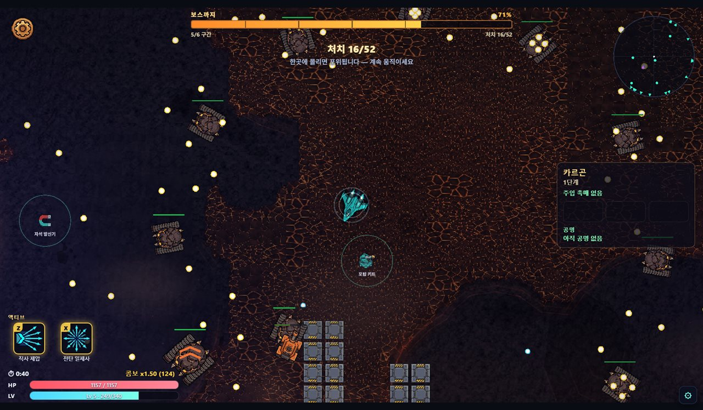
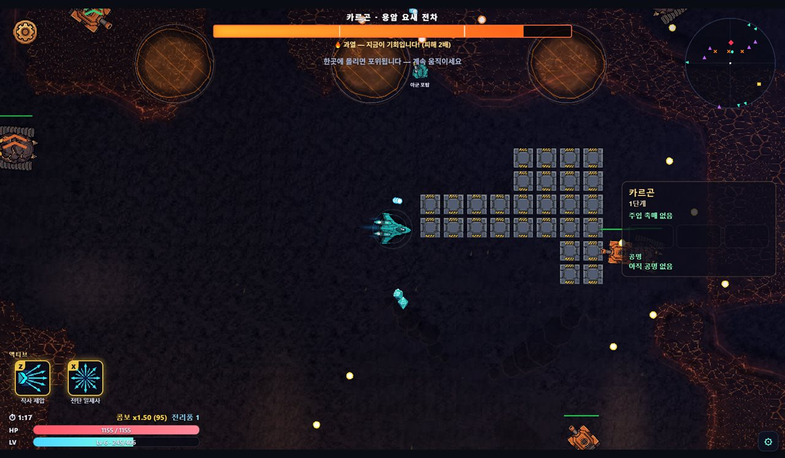
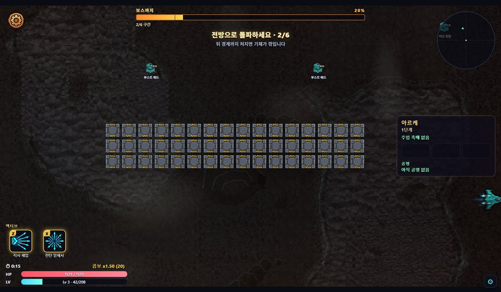
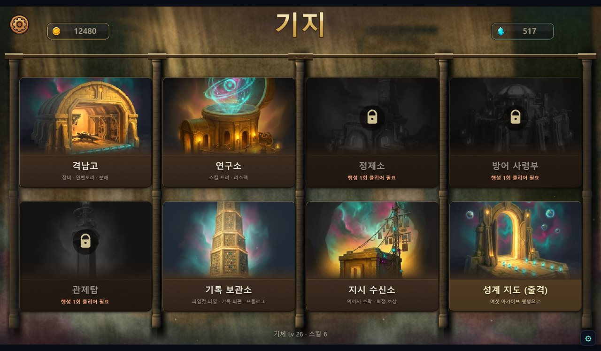
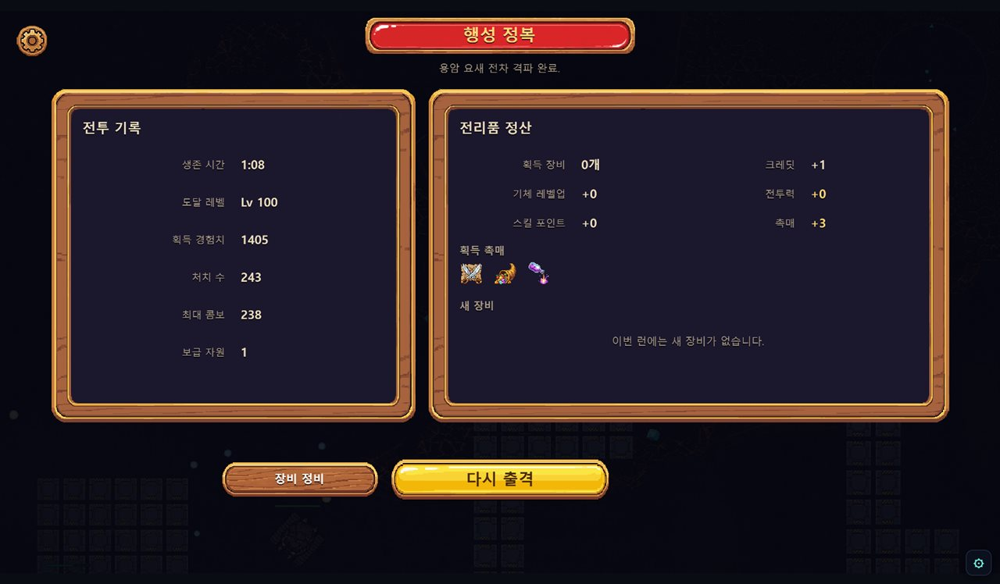
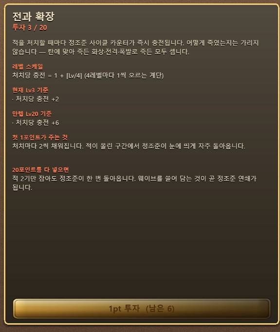
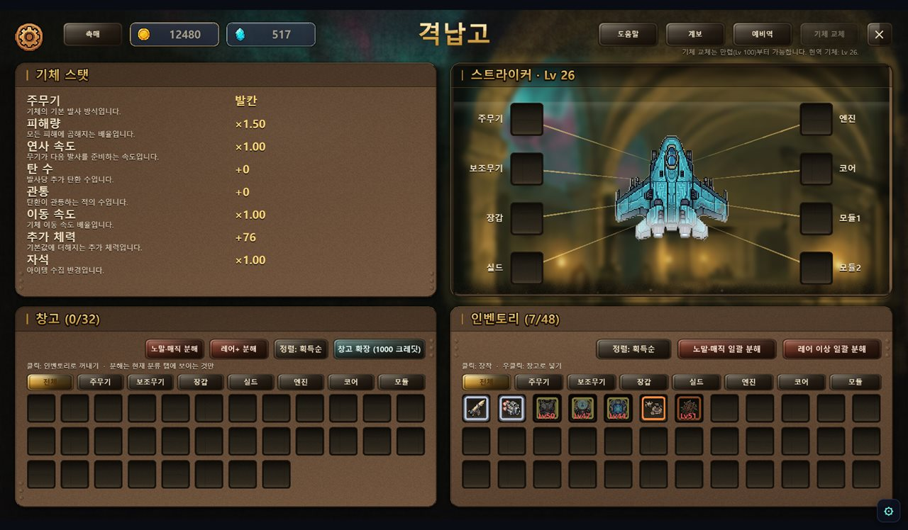

# Planet Blitz — 게임 소개 및 설명서

**NAN 2026 Game×AI 해커톤 사전 과제 · 개인 참가 김민석 (v0o0v2@gmail.com) · 2026-08-10**

## 1. 게임 제목 및 한 줄 소개

**Planet Blitz (플래닛 블리츠)**

> **"행성을 침략해 장비를 모으고, 그 힘으로 상위 랭커의 기지를 뚫어 자리를 빼앗는 탄막 슈팅."**

탑다운 탄막 슈팅에 핵앤슬래시식 장비 파밍과 비동기 PvP 래더를 붙인 웹 게임입니다. 공격은
자동으로 나가기 때문에 플레이어가 신경 쓸 것은 회피와 자리 잡기뿐입니다. 대신 무엇을 입고
무엇을 찍어서 출격하느냐에 따라 같은 행성도 전혀 다른 난이도가 됩니다.

개발 정보 — 1인 개발, 26일, 사람이 직접 타이핑한 게임 코드는 없습니다. 커밋 1,392건,
PR 498건, 자동 테스트 8,676건이 전량 통과합니다. 브라우저에서 바로 플레이할 수 있는
상태로 배포돼 있으며, 작업 방식은 「AI 활용 기술 문서」에 따로 정리했습니다.

## 2. 플레이 링크

| 항목 | 링크 |
|---|---|
| **플레이 · 심사용 데모 (로그인 불필요)** | *(데모 빌드 링크 — 배포 후 기재)* |
| **플레이 · 정식 (계정 연동)** | https://v0o0v.github.io/planet-blitz/ |
| **플레이 영상 (YouTube, 30~60초)** | *(영상 링크 — 업로드 후 기재)* |
| 소스 코드 (public) | https://github.com/v0o0v/planet-blitz |

데모 빌드 접속에 문제가 있으시면 심사용 임시 계정을 제공해 드립니다 — v0o0v2@gmail.com
으로 연락 주십시오.

정식 빌드에서 구글 로그인을 받는 이유는, 래더 자리를 두고 다투는 비동기 PvP가 계정 없이는
성립하지 않기 때문입니다. 다만 심사 과정에서 로그인이 번거로울 수 있어, 같은 소스에서 서버
설정만 빼고 빌드한 무로그인 데모를 따로 올려 두었습니다. 네트워크 계층이 설정이 없으면 알아서
아무 일도 하지 않도록 처음부터 만들어 둔 덕분에, 코드를 갈라 놓지 않고도 두 빌드가 나옵니다.

### 3분 심사 경로 (권장)

1. 데모 링크에 접속합니다. 데스크톱 Chrome·Edge에서 설치 없이 몇 초면 로딩됩니다
2. 첫 런을 한 번 돌아 봅니다(약 2분). `WASD` 이동과 `Space` 대시, 두 가지만 기억하시면 됩니다
3. 기지 맵에서 격납고에 들어가 방금 주운 장비를 장착하고 다시 출격합니다
4. 시간이 더 있으시면 행성 선택에서 다른 행성을 골라 보십시오. 게임플레이 방식 자체가 바뀝니다(§3)

### 화면 한눈에


*카르곤 · 아레나 서바이벌 — 상단에 이번 웨이브의 처치 할당, 우상단에 레이더, 하단에 액티브
스킬 슬롯이 있다*


*카르곤 보스전 — 보스가 큰 패턴을 쓰고 나면 5초 동안 과열 상태가 되어 받는 피해가 2배가
된다. 이 구간을 노리는 것이 보스전의 핵심이다*


*톡사르 · 오염 확산 — 적을 처치하는 것이 아니라 번지는 오염 구역을 정화하는 것이 목표다*


*아르케 · 레이싱 — 화면이 계속 왼쪽으로 흐르기 때문에 뒤로 물러설 수 없다. 바닥의 부스트
패드를 밟아 가며 앞으로 뚫는다*


*기지 — 건물 7종과 출격 게이트. 아직 열리지 않은 건물은 잠긴 상태로 보여서, 다음에 무엇이
열리는지 자연스럽게 알 수 있다*


*런 정산 — 이번 판의 전투 기록과 주운 전리품을 보여주고, 바로 다시 출격할 수 있다*

## 3. 게임 방법

### 목표

1. 행성으로 출격해(PvE) 장비와 재화를 모읍니다.
2. 기지로 돌아와 장비를 장착하고 스킬에 투자해 영구히 성장합니다.
3. 더 높은 침략 단계에 도전합니다.
4. 그렇게 쌓은 전력으로, **나보다 순위가 높은 플레이어의 기지를 침공해 그 자리를 빼앗습니다.**

### 조작 (마우스 + 키보드)

| 조작 | 키 |
|---|---|
| 이동 | `WASD` 또는 방향키 |
| 공격 | **자동** — 주무기가 가장 가까운 적을 자동 조준·연사 |
| 대시 | `Space` (쿨다운 · 대시 중 무적) |
| 파워업 선택 | 레벨업 시 3택 오버레이에서 마우스 클릭 |

**판정 규칙 한 가지만 기억하세요**: 적탄은 크고 눈에 잘 띄게 날아오지만 수가 많습니다.
실제 피격 판정은 기체 중심의 아주 작은 점뿐이라, 겹쳐 보이는 탄 사이로 빠져나갈 수 있습니다.

### 런 1회 — 2분 동안 벌어지는 일

출격하면 사방에서 적이 몰려옵니다. 주무기는 알아서 가장 가까운 적을 쏘기 때문에, 플레이어가
할 일은 탄막 사이를 비집고 다니며 경험치 젬을 **끊기지 않게** 줍는 것입니다. 연속으로 주울수록
배율이 올라가서, 안전한 곳에 숨어 있는 것보다 위험한 곳으로 파고드는 편이 이득이 되게 했습니다.

레벨이 오를 때마다 파워업 3장 중 하나를 고르고, 그 선택이 쌓이면서 이번 판의 빌드가
완성됩니다. 중간에 보급선이 지나가면 20초 안에 격추해 확정 장비를 챙길 수 있습니다.

웨이브는 시간이 아니라 **처치 할당**으로 넘어갑니다. 정해진 수만큼 잡지 못하면 적이 추가로
쏟아져 압박이 커지기 때문에, **강한 빌드는 판을 빨리 끝내고 약한 빌드는 오래 버텨야 합니다.**
빌드의 차이가 난이도 숫자가 아니라 판의 길이로 나타나는 셈입니다.

웨이브를 모두 넘기면 3페이즈 보스가 나옵니다. 보스가 큰 패턴을 쓰고 나면 5초 동안 과열 상태가
되어 받는 피해가 두 배가 되는데, 이 순간에 화력을 몰아넣는 것이 보스전의 핵심입니다. 과열
창을 몇 번 놓치느냐가 그대로 승패로 이어집니다.

- **승리 종료**: 보스 격파 → 정산 화면에서 전리품 획득, "다시 출격" 가능.
- **패배 종료**: 격추되면 런 종료 — 단, **주운 전리품은 전량 보존**됩니다. 잃는 것은 보스
  확정 드랍 기회뿐이라 부담 없이 재도전하게 설계했습니다.
- PvP **침공**은 규칙이 따로입니다. 5분 안에 상대 기지의 코어를 부수면 승리, 시간이 다
  되거나 중간에 격추되면 실패입니다. 자세한 내용은 §5-4에서 다룹니다.

### 행성 6곳 = 게임플레이 모드 6종

행성마다 난이도만 다른 것이 아니라 런의 규칙 자체가 다릅니다. 어느 행성으로 갈지 고르는 것이
사실상 오늘 어떤 게임을 할지 고르는 셈입니다.

- **카르곤** (화산·중장갑) — **아레나 서바이벌**: 사방에서 포위해 오는 적을 정해진 수만큼 처치해 웨이브를 넘긴다. 처음 시작하는 행성
- **베르단** (초원·곤충 군체) — **수축 지대**: 안전지대가 계속 좁아지는 가운데 물량을 버텨 낸다
- **니플헤임** (빙설·유령 함대) — **추격전**: 서리 안개 속으로 달아나는 유령 기함을 쫓아간다
- **아르케** (고대 기계 유적) — **레이싱**: 화면이 왼쪽에서 오른쪽으로 강제로 흐르는 속도전
- **톡사르** (오염·부식) — **오염 확산**: 계속 번지는 산성 오염 지대를 막고 정화한다
- **크라스** (파괴·관통) — **블록 격파**: 아래에서 위로 강제 전진하며 앞을 막은 지형을 부순다

## 4. 성장 시스템 — 스킬 · 장비 · 촉매

런 바깥에서 캐릭터를 키우는 축은 세 가지입니다. 셋이 각각 **오래 가는 선택**, **운을 다루는
선택**, **한 판만 걸고 하는 선택**을 맡도록 성격을 갈라 놓았습니다.

### 4-1. 스킬 210종 — 오래 가는 선택

기체는 7종이고, 기체마다 스킬 트리가 3계열씩 있습니다. 계열의 역할은 공격·방어·유틸리티로
공통이지만 이름과 내용물은 기체마다 다릅니다. 예를 들어 스트라이커는 화력·생존·기동이고,
팬텀은 암살·위상·교란입니다. **한 계열에 10종씩, 기체당 30종, 7기체를 합쳐 210종**입니다.

- **투자 자원은 스킬 포인트 하나뿐**입니다. 레벨이 1 오를 때마다 1점을 받고, 레벨 상한이
  100이니 한 기체가 평생 쥘 수 있는 점수는 99점입니다. 스킬 한 종에 최대 20점까지 넣을 수
  있으므로, **210종 중 실제로 키울 수 있는 것은 다섯 종 남짓**입니다. 무엇을 포기할지가
  곧 빌드입니다.
- **선행 조건 트리를 일부러 없앴습니다.** 10종 전부 처음부터 찍을 수 있습니다. 트리 구조는
  "가고 싶은 곳까지 가는 통행세"를 만들 뿐, 선택을 늘려 주지 않는다고 판단해 걷어냈습니다.
  대신 위의 99점 제약이 선택의 무게를 만듭니다.
- 잘못 찍었으면 **크레딧을 내고 초기화**할 수 있습니다. 점수는 전액 돌려받습니다.
- **액티브 스킬 42종**(기체당 6종)은 따로 찍는 것이 아니라, 해당 계열에 넣은 점수의 합에서
  자동으로 풀립니다. 누적 8점에서 하위 액티브가, 40점에서 상위 액티브가 열리고, 그 뒤로도
  **점수를 더 넣을수록 쿨다운이 줄고 위력이 오릅니다.** 화력을 파던 사람이 어느 순간 새 버튼을
  하나 얻는 셈이라, 한 계열을 깊게 파는 선택에 눈에 보이는 보상이 붙습니다. 장착은 두 칸(`Z`·`X`)뿐이라
  여섯 종 중 둘을 고르게 됩니다. 예를 들어 스트라이커의 상위 액티브 **전탄 일제사**는 사방으로
  광선을 한꺼번에 뿌리고, 브루저의 하위 액티브 **충각 돌진**은 앞으로 밀고 나가면서 장갑을
  쌓습니다. 팬텀의 상위 액티브 **무한 초격**은 일정 시간 동안 은신 해제 배율이 소모되지 않고
  계속 실립니다.


*연구소 스킬 상세 — 스킬마다 레벨에 따른 계산식과 현재 수치, 만렙 기준 수치를 함께 보여준다.
어떤 스킬에 점수를 더 넣을지 감이 아니라 숫자로 비교할 수 있게 한 화면이다*

**스킬 예시 — 스트라이커 (화력·생존·기동)**

| 스킬 | 계열 | 효과 |
|---|---|---|
| 전과 확장 | 화력 | 적을 처치할 때마다 정조준 사이클이 충전된다. 4레벨마다 충전량이 한 칸씩 늘어난다 |
| 파편 격발 | 화력 | 관통을 다 쓰고 사라지는 탄이 그 자리에서 터진다. 폭발 피해는 그 탄 피해의 30%에서 시작해 레벨당 2%p씩 오른다 |
| 연장 탄창 | 화력 | 정조준이 터지는 순간 같은 방향으로 한 번 더 쏜다. 추가 사격의 위력은 처음 40%에서 만렙 70%까지 오른다 |
| 최후 처형 | 생존 | 내 체력이 30% 아래일 때, 정조준탄이 빈사 상태의 적을 즉사시킨다 |
| 선체 증축 | 생존 | 이번 판에서 경험치를 일정량 쌓을 때마다 최대 체력이 영구히 늘어난다 |
| 이중 추진 | 기동 | 대시가 2회 충전식이 된다. 두 번째 충전은 별도로 느리게 차오른다 |

**빌드가 성립하는 이유 — 스킬끼리 조건을 주고받는다**

스트라이커의 30종은 서로 무관한 강화가 아니라 **정조준 사이클**이라는 하나의 축을 공유합니다.
정조준을 **채우는 쪽**(전과 확장은 처치할 때마다, 응전 조준은 얻어맞을 때마다)이 있고, 정조준이
터질 때 **얹히는 쪽**(연장 탄창의 추가 사격, 소이 정조준의 화상, 표적 고정, 최후 처형의 즉사
판정)이 있습니다. 그래서 화력 계열에 점수를 몰면 단순히 숫자가 커지는 것이 아니라 **발사 리듬
자체가 달라집니다.**

- **처형 빌드** — 전과 확장으로 정조준을 빠르게 돌리고, 최후 처형으로 체력이 30% 아래일 때
  적을 즉사시킵니다. 일부러 위험한 체력대를 유지해야 하는 고위험 빌드입니다.
- **암살 빌드 (팬텀)** — 팬텀은 은신에서 풀리는 첫 타에 배율이 붙습니다. 여기에 **공허 계약**
  (최대 체력을 깎는 대신 그 배율을 영구히 올림)과 **유령 탄도**(은신 중 쏜 탄이 벽을 통과)를
  얹으면, 벽 너머의 적을 한 방에 지우는 형태가 됩니다.
- **무리 빌드 (해츨링)** — 해츨링은 단발 화력이 가장 낮은 대신 병아리 무리를 부립니다.
  **격발 공명**은 내가 쏠 때마다 병아리 전원의 쿨다운을 깎고, **여왕 사출**은 동시에 낼 수
  있는 마릿수를 일부러 줄이는 대신 남은 개체를 강하게 만듭니다.

**몰아 찍기가 항상 옳지는 않습니다.** 위의 여왕 사출은 마릿수를 늘려 주는 확장 둥지와 정면으로
상쇄되므로 둘 중 하나만 골라야 합니다. 관통 위주로 짠 빌드에 표적 고정을 넣으면 관통이 표적을
계속 갈아치워 효과가 죽고, 소이 정조준의 화상은 보스의 과열 창과 슬롯이 겹쳐 보스에게는
걸리지 않습니다. **이런 궁합 정보를 스킬 상세 화면에 그대로 적어 두었습니다** — 알아서 검증하게
만드는 대신 게임이 먼저 알려 주는 쪽을 택했습니다.

### 4-2. 장비 — 운을 다루는 선택

장비는 슬롯 7종에 8칸입니다(주무기·보조무기·장갑·실드·엔진·코어, 그리고 모듈은 두 칸).
등급은 노말·매직·레어·유니크 4단계이고, 등급이 높을수록 **붙는 옵션(어픽스) 개수**가 늘어납니다.
노말은 1개, 매직은 2~3개, 레어와 유니크는 3~6개입니다.

- 어픽스 풀은 **30종**입니다. 공격 계열 12종, 유틸·생존 계열 12종에 더해, **스킬 축에
  +1~+2를 직접 얹어 주는 어픽스 6종**이 있습니다. 이 6종 덕분에 스킬은 투자 상한 20을 넘겨
  최대 24까지 올라갈 수 있습니다. 다만 슬롯마다 받을 수 있는 축이 정해져 있고 장비 하나에
  스킬 어픽스는 최대 1개만 붙어서, **초과분의 천장이 확률이 아니라 구조로 막혀 있습니다.**
- **요구 레벨 게이트**가 있습니다. 좋은 장비가 나와도 레벨이 모자라면 못 입습니다. 요구
  레벨은 등급과 어픽스 개수에서 계산되고, 여기에 **그 장비가 떨어진 침략 단계와 당시 기체
  레벨로 상한**이 걸립니다. 저단계에서 주운 물건이 감당 못 할 요구 레벨을 달고 나오는 일을
  막기 위한 장치입니다.
- 마음에 안 드는 옵션은 **정제소에서 다시 굴립니다.** 이 부분을 단순 리롤이 아니라 판돈을
  키우는 구조로 만들었습니다.

**정련 — 한 번 더 굴릴 것인가**

굴릴 때마다 마음에 드는 옵션 **하나를 고정**할 수 있습니다. 대신 고정은 되돌릴 수 없고,
고정한 개수가 늘수록 **장비가 녹아 없어질 확률이 가파르게 올라갑니다.** 여기에 노 출력을
약불·중불·강불 중에 고르는데, 이 셋은 **비용·용해 위험·나오는 수치의 품질이 한 몸으로**
움직입니다. 강불은 좋은 수치가 나오지만 비용이 두 배고 녹을 확률도 훨씬 높습니다.

옵션 6개짜리 레어를 4개까지 고정해 놓고 강불로 마지막 한 번을 더 굴릴지 말지 — 이 판단이
정제소의 재미 전부입니다. 참고로 아무것도 고정하지 않았을 때의 용해 확률은 정확히 0이라,
안전하게만 쓸 수도 있습니다.


*격납고 — 슬롯 7종 8칸. 요구 레벨이 모자란 장비는 빨간 표기와 함께 잠긴다*

### 4-3. 촉매 48종 — 한 판만 걸고 하는 선택

촉매는 출격 직전에 주입하는 소모품으로, **한 런에 최대 3장**을 넣습니다. 같은 카드를 겹쳐
넣을 수는 없고, 특산 촉매는 최대 2장까지입니다.

- 공용 30종은 어느 행성에서나 나오고, **특산 18종은 행성 6곳에 3종씩** 배정돼 있어 그
  행성으로 출격할 때만 쓸 수 있습니다.
- 촉매에는 등급이 없습니다. 대신 나오는 빈도가 종류마다 달라서, 흔한 것과 귀한 것이 갈립니다.
  가장 귀한 한 종은 다른 촉매의 10분의 1 빈도로만 나옵니다.
- **모든 촉매는 양날입니다.** 이득과 대가가 별개의 수치 두 칸이 아니라, **하나의 규칙 문장에서
  같이 나옵니다.** 이렇게 바꾼 이유는 앞선 설계가 실패했기 때문입니다. 처음에는 "보상 축 +N,
  페널티 축 −N" 형태로 만들었는데, 계수가 공통 상수에서 나오다 보니 **촉매끼리 실제 수치
  차이가 0이고 이름과 아이콘만 다른** 상태가 됐습니다. 그래서 48종을 규칙 문장 단위로 다시
  썼습니다.
- 촉매가 올려 주는 보상에는 **상한이 걸립니다.** 획득량·자원·희귀도·경험치·촉매 획득률
  다섯 축이 있고, 세 장을 넣어도 그냥 곱해지지 않고 합성식을 거쳐 천장 안으로 들어옵니다.
  이 상한은 밸런스 수치가 아니라 서버 정산과 맞춰 둔 계약값입니다.

**촉매 예시**

아래는 게임 안에 그대로 적혀 있는 규칙 문장입니다. 한 문장 안에 이득과 대가가 같이 들어
있는 것을 보실 수 있습니다.

| 촉매 | 규칙 |
|---|---|
| **풍요** | 전리품이 두 배로 떨어지지만, 바닥에 다섯 개 이상 쌓여 있는 동안에는 적들이 그 더미 크기만큼 빨라진다 |
| **정련** | 주운 전리품이 바로 회수되지 않고 정련로에 쌓여 같은 등급 셋째부터 한 단계 위로 승급하지만, 정련로에 남은 것은 지면 전부 잃는다 |
| **통찰** | 적탄이 발사되기 전 예고 링으로 미리 보이지만, 그 예고 링 **안에 서 있는 동안만** 경험치가 세 배로 들어온다 |
| **초월** | 최대 체력이 절반이 되지만, 대시 무적 시간이 두 배가 되고 그동안 통과한 적은 2초간 움직이지 못한다 |

특산 촉매는 그 행성의 규칙과 엮여 있습니다. 카르곤 전용 **마그마 광맥**은 내가 쏜 탄이 지나간
자리에 용암이 솟아 적도 나도 태우지만, 용암 위에서 죽은 적은 전리품을 두 배로 뱉습니다.
아르케 전용 **오벨리스크**는 보스 앞에 관문 셋을 세워, 통과한 만큼 보스가 약해지고 통과하지
못한 관문의 힘은 그대로 보스에게 넘어갑니다.

가장 귀한 촉매가 위의 **초월**입니다. 다른 촉매의 10분의 1 빈도로만 나오는데, 하는 일은
체력을 절반으로 깎는 대신 대시를 공격 수단으로 바꿔 놓는 것입니다. 강력하지만 회피에
자신이 없으면 쓸 수 없습니다.

**공명 — 3장을 아무렇게나 고르지 않게 만드는 장치**

촉매마다 성향 태그가 1~2개 붙어 있습니다(점화·밀도·정밀·수확·도박·침식). 넣은 3장에서
**같은 태그가 2장 모이면 약한 공명, 3장이 모두 모이면 강한 공명**이 발동합니다. 태그 6종에
2단계씩, 총 12종입니다.

강한 공명은 보상 상한을 크게 열어 주지만 그만큼 대가도 큽니다. 예컨대 도박 태그 3장이
모이면 첫 전리품이 **봉인된 채로 떨어져서**, 보스를 잡으면 최고 등급으로 열리고 도중에
죽으면 그대로 사라집니다. 침식 태그의 강한 공명은 획득량을 두 배로 만들지만 두 행성에서는
아예 발동하지 않습니다.

즉 촉매 고르기는 "좋은 것 세 장 고르기"가 아니라 **"어느 태그로 모을지, 아니면 안전하게
흩을지"** 를 정하는 일입니다. 궁합이 나쁜 조합은 출격 전 화면에서 회색·노란색 경고로 미리
알려 주되, 런 안에서 효과를 꺼 버리지는 않습니다. 줄어든 형태로라도 반드시 작동하게 해서
"넣었는데 아무 일도 안 일어남"을 없앴습니다.

**촉매 잔재 — 안 쓰는 촉매를 처리하는 법**

쓸 일 없는 촉매는 분해해서 **잔재**로 바꿉니다. 잔재는 크레딧·광물과 완전히 분리된 화폐로,
**촉매를 분해해야만 생기고 촉매를 사는 데만 쓰입니다.** 환급률은 구매가의 절반이라 무한
증식이 안 되고, 상점에는 공용 30종만 진열되므로 특산은 분해만 되고 되살 수는 없습니다.
덕분에 촉매 경제가 다른 재화 흐름을 건드리지 않고 안에서 닫힙니다.

### 4-4. 재화 정리

| 재화 | 쓰는 곳 |
|---|---|
| 스킬 포인트 | 스킬 투자 (레벨업으로만 획득) |
| 크레딧 | 스킬 초기화, 각종 구매 |
| 광물 | 장비 정련(리롤) |
| 촉매 잔재 | 촉매 구매 (촉매 분해로만 획득) |
| 설계도 | 기지 방어 유닛 제작 |

## 5. 전체 진행 루프 — 첫 런부터 엔드게임까지

### 5-1. 처음 30분 — 기지가 하나씩 열린다

시작하면 기체 한 대와 기본 장비만 있습니다. 기지에서 처음 열려 있는 곳은 격납고(장비)와
연구소(스킬), 기록 보관소, 지시 수신소뿐이고 나머지는 잠겨 있습니다.

**행성을 한 번 클리어하는 순간 세 곳이 한꺼번에 열립니다** — 장비를 다시 굴리는 정제소,
방어 배치를 짜는 방어 사령부, 그리고 래더와 침공을 여는 관제탑입니다. 첫 클리어에 성장
축과 PvP를 동시에 붙여서, "한 판만 이겨 보면 게임이 확 넓어지는" 지점을 만들었습니다.

침략 단계는 처음부터 1~10단계가 열려 있고, 그 뒤로는 **가장 높이 깬 단계보다 5단계 앞까지**
계속 열립니다. 레벨이 단계를 잠그지는 않습니다 — 단계는 순수하게 난이도 표시이고, 실력과
빌드가 되면 얼마든지 앞서 갈 수 있습니다. 다만 자기 레벨보다 세 단계 넘게 낮은 곳에서
파밍하면 보상이 단계당 10%씩 깎여서(최저 30%), 편한 곳에 눌러앉는 것이 손해가 되게 했습니다.

**기지 건물 7종 — 각각 무엇을 하는 곳인가**

| 건물 | 하는 일 | 열리는 시점 |
|---|---|---|
| **격납고** | 장비 장착과 창고 관리. 등급별 일괄 분해, 획득순·희귀도·슬롯 정렬, 창고 확장, 기체 교체와 예비역(수호기)·계보 확인 | 처음부터 |
| **연구소** | 스킬 트리에 포인트 투자, 크레딧을 내고 전체 초기화, 액티브 스킬 2칸 장착·해제 | 처음부터 |
| **기록 보관소** | 파일럿 파일과 기록 파편 열람, 프롤로그 다시 보기 | 처음부터 |
| **지시 수신소** | 보유 의뢰서 목록과 상세(구간·확정 보상·제약) 확인 후 출격하거나 폐기 | 처음부터 |
| **정제소** | 장비 어픽스 정련. 굴리기, 어픽스 고착, 열 3단계(약한 열·중간 열·강한 열) 선택, 공정 중단 | 행성 1클리어 |
| **방어 사령부** | 침공 방어 배치. L1 대기권·L2 회랑·L3 코어방 세 탭에 유닛을 놓고, 보관함에서 설계도로 제작·레벨업·승격·어픽스 리롤. 저장 전에 **시험 침공**으로 직접 뚫어 볼 수 있다 | 행성 1클리어 |
| **관제탑** | 래더 순위 확인, 침공 대상 목록과 **기지 정찰**(상대의 L1~L3 구성 미리보기), 침공·배치전·복수 진입, 격퇴한 상대에게 도발 스티커 | 행성 1클리어 |

방어 사령부의 **시험 침공**은 자기가 짠 방어를 직접 공격해 보는 기능입니다. 남이 뚫는 걸
기다렸다가 결과로만 배우는 대신, 배치를 바꿀 때마다 바로 확인할 수 있게 했습니다.

### 5-2. 중반 — 하루를 채우는 것들

레벨이 오르면서 런 한 판이 짧아지면, 그때부터는 런 바깥의 루프가 하루를 채웁니다.

- **일일 보상** — 연속 접속 30일이 한 주기이고, 1일차에서 30일차까지 보상이 직선으로 올라간
  뒤 다시 1일차로 돌아갑니다.
- **촉매 상점** — 안 쓰는 촉매를 분해해 잔재로 바꾸고, 그 잔재로 필요한 촉매를 삽니다.

**의뢰서 — 규칙이 바뀐 채로 두 구간을 돌파한다**

행성 보스를 잡고 이긴 런의 약 30%에서 의뢰서가 발급됩니다. 게임 안 설명은 이렇습니다.

> 발급되는 순간 내용이 확정되는 의뢰서입니다. 구간과 보상이 그때 정해지고, 완수하면 적힌
> 그대로 지급됩니다.

즉 의뢰서는 **받아 두고 나중에 꺼내 쓰는 예약된 런**입니다. 한 장이 두 구간으로 이뤄지고,
구간마다 지정된 행성과 침략 단계로 연달아 출격합니다. 계급은 정기·우선·특급·최종 4단계이고,
계급이 높을수록 섞이는 침략 단계가 높아지고 확정 경험치가 최대 1.6배까지 붙습니다.

핵심은 **주문 4종이 런의 규칙 자체를 갈아 끼운다**는 점입니다.

| 주문 | 무엇이 달라지는가 |
|---|---|
| **연쇄 원정** | 지정된 행성들을 연달아 밟고 종점에서 의뢰 보스를 잡습니다. 구간이 넘어갈 때 **행성 모드가 통째로 바뀌므로**, 아레나로 시작해 레이싱으로 끝나는 식이 됩니다 |
| **제약 계약** | 적을 강하게 하는 대신 **나를 묶습니다.** 특정 슬롯을 봉인하거나, 장비 등급 상한을 걸거나, 특정 파워업 계열을 금지합니다. 위반이 아예 불가능하게 만들어서, 금지된 장비는 출격 조립에서 빠지고 금지된 파워업은 3택 후보에 나타나지도 않습니다 |
| **현상금 표적** | 지정된 변종을 추적합니다. **네 주문 중 유일하게 실패할 수 있습니다** — 표적은 체력이 20% 아래로 떨어지거나 30초를 버티면 도주하고, 도주하는 순간 그 구간이 끝납니다 |
| **정예 소집령** | 잡몹도 경험치 젬도 나오지 않습니다. 즉 **런 안에서 전혀 성장하지 못한 채** 영구 성장만으로 정예들을 상대합니다. 처치가 늦으면 다음 정예가 겹쳐 내려오므로 시간이 곧 압박입니다 |

정예 소집령을 받아 들면 화면에 이렇게 경고가 뜹니다.

> 런 내 성장 없음 — 경험치 젬도, 레벨업도, 파워업 선택도 없습니다. 영구 성장만으로 싸웁니다.

같은 게임을 매번 같은 방식으로 하지 않게 만드는 것이 의뢰서의 목적입니다. 마음에 들지 않는
의뢰서는 폐기할 수 있지만 되돌릴 수는 없습니다.

**설계도 — 남의 방어를 내 방어로 만든다**

설계도는 기지 방어 유닛의 제작 단위입니다. 얻는 길이 둘인데, 하나는 행성을 클리어할 때
3% 확률로 떨어지는 것이고, **다른 하나는 남의 기지를 뚫었을 때 12% 확률로 그 사람이 배치해
둔 방어체의 설계도를 빼앗아 오는 것**입니다. 나를 괴롭힌 방어를 그대로 내 것으로 만들 수
있다는 뜻입니다.

만들 수 있는 방어체는 편대 12종, 설비 17종, 기물 6종, 방어 보스 3종입니다.

| 종류 | 예시 |
|---|---|
| 편대 (1층) | **정찰 드론편대** — 경량 드론 5기가 V자를 유지한 채 진입로를 따라 내려온다 / **기뢰 살포선** — 뒤로 고정형 기뢰를 넓게 깔아 통로를 봉쇄한다. 스크롤이 공격자를 그 위로 밀어 넣는다 / **지원 편대** — 모체를 회복 드로이드가 따라다녀, 무엇부터 잡을지 판단을 강요한다 |
| 설비 (2층) | **속사포** — 근거리를 꾸준히 훑는 기본 포대 / **관통 레일포** — 예고선을 그은 뒤 관통탄 한 발 / **견인 자기장** — 스스로는 피해를 주지 않고 감속 장판만 세워, 다른 설비의 사격을 맞게 만든다 / **압축 프레스** — 부술 수 없는 판이 회랑 안쪽까지 뻗었다 되돌아온다 |
| 기물 (3층) | **실드 발생기** — 코어를 보호막으로 감싼다. 이걸 먼저 부수지 않으면 코어에 흠집도 안 난다 / **기만 홀로그램** — 실루엣도 조준 우선순위도 코어와 똑같은 가짜 코어. 부숴도 승리가 서지 않으니, 여기 쏟은 화력 자체가 이 기물의 피해다 |
| 방어 보스 (3층) | **강철 골리앗** — 3페이즈 정통파 수문장 / **포자 여왕** — 장판과 용암 기둥으로 설 자리를 계속 빼앗는 지형 장악형 / **위상 감시자** — 장판을 전혀 깔지 않고 탄막 사이의 틈만 남기는 순수 회피형 |

같은 설계도가 또 나오면 버리는 것이 아니라 **승격**에 씁니다. 승격하면 체력과 피해가 오르고
외형도 바뀌어서, 침공해 온 상대에게 보이는 과시 수단이 됩니다. 이와 별개로 **등급 승급**은
중복 설계도를 써서 방어체의 옵션을 다시 굴리는 기능입니다. 즉 방어체 강화는 레벨·승격·옵션
리롤 세 축입니다.

행성마다 나오는 설계도가 겹치지 않게 배정돼 있습니다. 카르곤은 화염과 직격, 베르단은 물량과
소환, 니플헤임은 저지와 보호, 아르케는 정밀과 기계 쪽입니다. **원하는 방어 유닛이 어느
행성에서만 나온다**는 점이 행성 선택의 또 다른 이유가 됩니다.

### 5-3. 퇴역과 계보 — 레벨 100에 도달하면

레벨 상한은 100입니다. 상한에 닿은 기체는 **퇴역**시킬 수 있고, 여기가 이 게임의 성장 구조에서
가장 중요한 마디입니다.

퇴역하면 그 기체는 사라지지 않고 **수호 기체가 되어 내 기지 코어 방을 지킵니다.** 이때 장착
중이던 장비가 그대로 봉인되어 수호기의 성능이 되므로, 되찾을 수는 없습니다. 그 대가로 계보
포인트 50점과 함께 새 기체를 1레벨부터 시작하는데, **다음 기체는 7종 중 무엇이든 자유롭게
고를 수 있습니다.**

즉 "내가 100레벨까지 키운 기체가, 이제 남의 침공을 막아 주는 방어 전력이 된다"가 이 게임의
엔드게임 동력입니다. 세대를 넘길수록 코어 방이 두터워지고, 계보 포인트로 다음 세대가 조금씩
유리해집니다. 수호 기체 자리는 두 칸이라, 어떤 기체를 어떤 장비를 입힌 채로 남길지가 또
하나의 선택이 됩니다.

### 5-4. 침공 — 이 게임의 엔드게임

관제탑에서 침공에 들어갑니다. 먼저 NPC 기지를 상대로 **배치전 5판**을 치러 초기 순위를
받고, 그 뒤로는 실제 플레이어의 기지를 칩니다.

**상대는 마음대로 고를 수 없습니다.** 후보로 뜨는 것은 내 바로 위 3명과, 위로 30위 이내에서
뽑힌 무작위 1명입니다. 같은 상대에게는 한 시간 동안 다시 도전할 수 없습니다. 무한 재도전으로
순위를 밀어 올리는 것을 막기 위한 장치입니다.

**침공 런은 3단 구조입니다.** 일반 런과 달리 스테이지가 이어지고, 체력이 그대로 승계되며,
중간에 죽으면 그 자리에서 실패입니다. 회복 지점은 각 단계를 넘길 때뿐입니다.

| 단계 | 무대 | 지키는 것 | 시간 |
|---|---|---|---|
| 1 | 행성 외곽 (세로 스크롤) | 방어자가 배치한 **편대** 6슬롯 | 90초 |
| 2 | 기지 회랑 (가로 스크롤) | 설치형 **설비** 8~12소켓 | 90초 |
| 3 | 코어 방 (고정 화면) | **기물** 6 + **수호 기체** 2 + **방어 보스** 1 + 코어 | 120초 |

- 각 단계를 넘길 때마다 최대 체력의 20%를 회복하고 폭탄을 하나 받습니다.
- **한 구간의 적을 전멸시키면 화면 스크롤이 빨라집니다**(최대 2배). 강한 빌드는 침공을
  빠르게 끝내고, 약한 빌드는 화면에 붙들려 시간에 쫓깁니다. 시간 자체가 난이도가 되는
  구조입니다.
- 코어는 체력 8,000짜리 별도 목표물이고, 코어 방에는 방어자가 붙인 **코어 모듈** 2개가
  공격자 유형에 반응해 작동합니다.
- 전체 제한은 5분입니다.

**이겼을 때**

- 순위가 30 이내 차이면 **상대와 순위를 맞바꿉니다.**
- 상대 창고에서 장비를 **최대 3개까지 복제해서** 가져옵니다. 복제라서 **진 쪽은 아무것도
  잃지 않습니다.** PvP 보상이 상대에게서 빼앗는 형태가 되면 당하는 쪽이 게임을 접기 때문에,
  이득은 공격자에게만 주고 손실은 만들지 않는 쪽을 택했습니다.
- 12% 확률로 상대가 배치해 둔 방어체의 설계도를 얻습니다. 상대의 방어를 뚫으면 그 방어를
  내 것으로 만들 수 있다는 뜻입니다.

**졌을 때 잃는 것은 없습니다.** 순위도 그대로고 재화도 깎이지 않습니다. 대가는 그 상대에게
한 시간 못 간다는 것뿐입니다. 대신 **나를 이기고 순위를 가져간 상대에게는 24시간 동안
복수전**이 열리고, 이때는 쿨다운과 순위 격차 제한이 모두 면제됩니다.

**방어 쪽도 놀지 않습니다.** 방어 사령부에서 설계도로 만든 방어체(§5-2)를 세 층에 나눠
배치합니다. 어떤 편대를 1층에 세우고 어떤 설비로 2층 회랑을 막을지가 곧 내 기지의 성격이
됩니다. 채우지 못한 슬롯은 기본 수비대가 자동으로 메워 주므로 빈칸이 그대로 뚫리지는
않습니다. 배치를 바꿀 때마다 **시험 침공**으로 직접 뚫어 보며 확인할 수 있습니다.

다만 방어 설비는 **매주 정비도가 5%p씩 떨어지고**, 0이 되면 성능이 절반까지 내려갑니다.
30일 넘게 접속하지 않으면 순위도 조금씩 내려갑니다. 방어는 한 번 짜 두고 끝나는 것이
아니라 관리 대상입니다.

방어에 성공하면 크레딧과 전적을 받고, 침공과 방어 양쪽에서 **도발 스티커** 12종 중 하나를
상대에게 남길 수 있습니다.

### 5-5. 루프 요약

```
행성 침략 → 장비·설계도·촉매 획득 → 격납고에서 장착 · 정제소에서 정련 ·
연구소에서 스킬 투자 → 더 높은 단계 도전 → 레벨 100 → 퇴역(수호 기체로 전환)
      ↘                                                          ↙
        관제탑에서 침공 → 순위 교환 · 장비 복제 · 설계도 약탈
        방어 사령부에서 배치 → 남의 침공을 막고 보상
```

바깥 루프(침공)에서 얻은 설계도가 방어를 두껍게 하고, 안쪽 루프(행성 침략)에서 얻은 장비가
침공 화력이 되며, 100레벨에 도달한 기체가 다시 방어 전력으로 돌아옵니다.

## 6. 실행 방법

- **따로 설치할 것이 없습니다.** 위 플레이 링크를 데스크톱 브라우저(Chrome·Edge 권장,
  1920×1080 기준으로 만들었고 창 크기에 맞춰 레터박스로 조정됩니다)로 열면 몇 초 로딩 후
  바로 시작됩니다. 조작이 키보드 전용이라 모바일은 지원하지 않습니다.
- **심사용 데모**: 로그인 없이 즉시 플레이. 진행도는 브라우저(localStorage)에만 저장됩니다.
- **정식 빌드**: 타이틀에서 구글 계정 선택 1회 → 진행도·장비·래더가 계정에 저장되고,
  침공(PvP)·의뢰·일일 보상 등 서버 연동 콘텐츠가 열립니다. 별도 가입 절차·비용 없음.
- 소스 저장소는 public이라 코드·커밋 이력·테스트를 자유롭게 열람하실 수 있습니다.

## 7. 플레이 영상

30~60초 실플레이 영상: *(YouTube 링크 — §2 표와 동일)*

영상 목차: 0:00 아레나 탄막 회피 → 0:10 행성 전환(모드가 바뀌는 순간) → 0:20 보스전 과열 창
→ 0:32 정산·격납고 장비 장착 → 0:42 침공(PvP) 코어 파괴.
